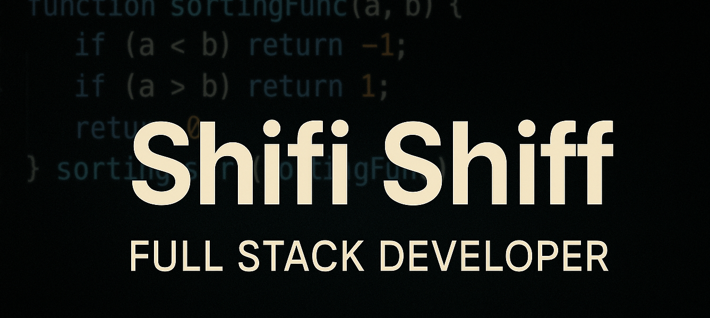

  

# 👋 Hi, I’m Shifi Shiff

🎯 Full Stack Developer | ❤️ Passionate about Code & Design | 🚀 Always Learning

### 🚀 Languages & Technologies  
 
 
 
 
 
 
 
 
 
 

---

### 🧱 Frameworks & Tools  
 
 
 
 
 
 
 
 
 

📫 **Contact**: [sh0527132865@gmail.com](mailto:sh0527132865@gmail.com)

